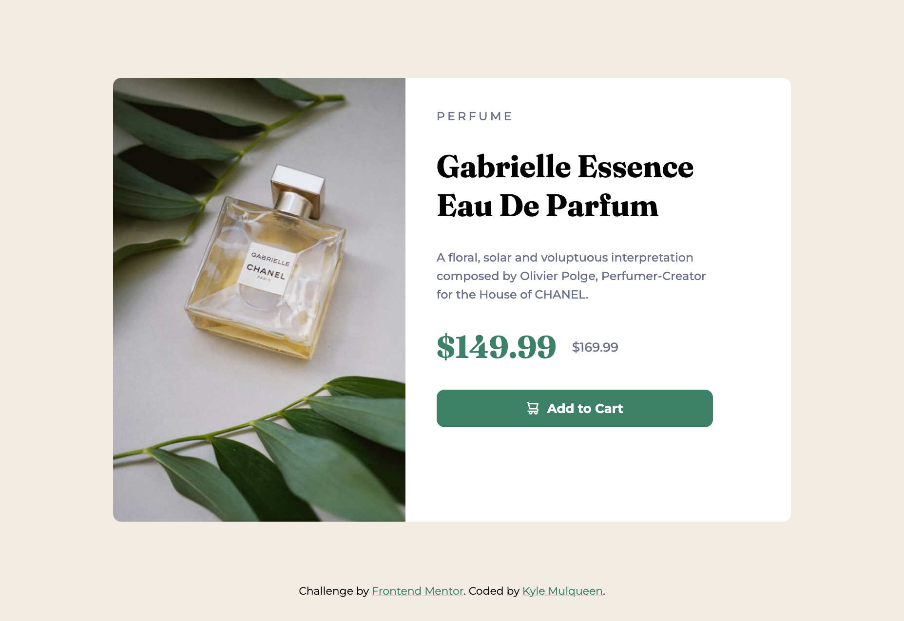
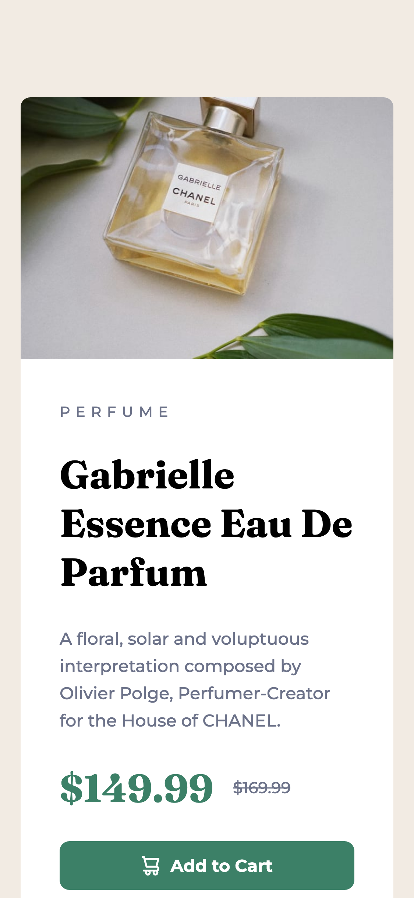

# Frontend Mentor - Product preview card component solution

This is a solution to the [Product preview card component challenge on Frontend Mentor](https://www.frontendmentor.io/challenges/product-preview-card-component-GO7UmttRfa). Frontend Mentor challenges help you improve your coding skills by building realistic projects.

## Table of contents

- [Frontend Mentor - Product preview card component solution](#frontend-mentor---product-preview-card-component-solution)
  - [Table of contents](#table-of-contents)
  - [Overview](#overview)
    - [The challenge](#the-challenge)
    - [Screenshot](#screenshot)
    - [Links](#links)
  - [My process](#my-process)
    - [Built with](#built-with)
    - [What I learned](#what-i-learned)
    - [Continued development](#continued-development)
    - [Useful resources](#useful-resources)
  - [Author](#author)

## Overview

### The challenge

Users should be able to:

- View the optimal layout depending on their device's screen size
- See hover and focus states for interactive elements

### Screenshot


**Desktop solution**


**Mobile solution (clipped in screenshot)**

### Links

- Solution URL: [GitHub Pages](https://kmulqueen.github.io/product-preview-card-challenge/)

## My process

### Built with

- Semantic HTML5 markup
- CSS custom properties
- Flexbox
- Mobile-first workflow

### What I learned

Through this project, I gained valuable experience with several key web development concepts:

- **Responsive images using the `<picture>` element**: I learned that when dealing with images that have different aspect ratios for mobile and desktop, the `<picture>` element provides more explicit control than `srcset` and `sizes` attributes.

```html
<picture>
  <source
    media="(min-width: 768px)"
    srcset="./images/image-product-desktop.jpg"
  />
  <source srcset="./images/image-product-mobile.jpg" />
  
</picture>
```

- **SVG manipulation with CSS masks**: I implemented a technique to control SVG color using CSS mask properties, which allows for easy theming without modifying the SVG file.

```css
.cart-icon {
  display: inline-block;
  width: var(--spacing-200);
  height: var(--spacing-200);
  background-color: currentColor;
  mask-image: url("./images/icon-cart.svg");
  mask-size: contain;
}
```

- **Creating responsive layouts using flexbox**: I learned how to create a card layout that changes from vertical to horizontal orientation at different breakpoints.

### Continued development

In future projects, I plan to focus on:

1. **Advanced responsive typography**: I want to refine my approach to font scaling using `clamp()` and CSS custom properties, particularly understanding the compounding effects when using relative units.

2. **Semantic HTML structure**: I aim to establish stronger semantic foundations from the beginning of projects rather than restructuring later.

3. **Accessibility best practices**: I'd like to deepen my knowledge of ARIA roles and ensure my components are fully accessible across different devices and assistive technologies.

4. **CSS variable scoping**: I want to explore more advanced techniques for managing CSS custom properties across different breakpoints and component states.

### Useful resources

- [MDN Web Docs: The Picture Element](https://developer.mozilla.org/en-US/docs/Web/HTML/Element/picture) - This comprehensive guide helped me understand how to implement responsive images with different aspect ratios for different viewport sizes.

## Author

- Website - [Kyle Mulqueen](https://www.your-site.com)
- Frontend Mentor - [@kmulqueen](https://www.frontendmentor.io/profile/kmulqueen)
